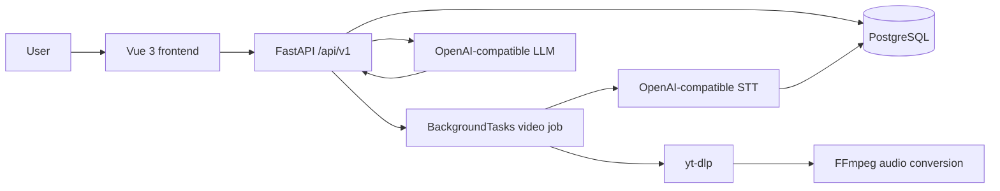

# English Interview Coach for IT

AI-powered practice app for technical English interviews based on YouTube videos.

English Interview Coach for IT turns a technical YouTube video into an interview
practice workspace: the backend downloads and transcribes the audio, then an AI
coach helps users practice technical answers, improve grammar and vocabulary,
structure stronger responses, and run mock interviews based on the video content.

## Problem

IT specialists often learn from technical talks and tutorials, but interview
practice requires a different skill: explaining the same concepts clearly,
concisely, and confidently in English. Generic chatbots do not know which source
material the user is studying, and video notes alone do not provide interview
feedback.

## Solution

The app ingests a YouTube video, extracts audio with `yt-dlp` and FFmpeg,
transcribes it through an OpenAI-compatible STT model, and opens a practice chat
grounded in the transcript. The coach asks interview-style questions, reviews
answers, improves wording, extracts useful technical vocabulary, and keeps the
session focused on IT interview communication.

## Demo Flow

1. Add a technical YouTube URL in the Vue frontend.
2. The backend creates a processing job and returns `queued` status immediately.
3. The frontend polls the video until it becomes `ready` or `failed`.
4. Start a practice session for a ready video.
5. Send answers or use starter actions for interview questions, vocabulary, mock
   interviews, and answer improvement.

## Features

- Vue 3 + TypeScript frontend with upload, video library, status polling, detail
  view, transcript preview, and chat practice panel.
- FastAPI backend with versioned `/api/v1` routes and legacy root routes for
  simple backwards compatibility.
- PostgreSQL persistence for videos, processing status, chat sessions, and
  messages.
- Production-like video job flow using FastAPI `BackgroundTasks`.
- YouTube audio extraction with `yt-dlp`, FFmpeg conversion, retries, duration
  limits, optional cookies support, and safe user-facing errors.
- OpenAI-compatible STT and LLM clients configured for OpenRouter-compatible APIs.
- Configurable CORS origins through environment variables.
- Health endpoint with database status.
- Pytest coverage for health, OpenAPI contract, YouTube URL normalization,
  prompt building, and service-level mocked STT/LLM flows.

## Architecture



## Tech Stack

- Backend: Python 3.13, FastAPI, Pydantic v2, psycopg, pytest.
- AI clients: OpenAI Python SDK against an OpenAI-compatible base URL.
- Media: yt-dlp and FFmpeg.
- Frontend: Vue 3, TypeScript, Vite, plain CSS.
- Runtime: Docker Compose with PostgreSQL, backend, and Nginx-served frontend.
- Quality: Ruff, Mypy, Bandit, Pytest, GitHub Actions.

## Screenshots

Screenshots are not committed yet. Suggested captures:

- Video upload and empty state.
- Processing status in the video library.
- Ready video detail with transcript preview.
- Chat practice session with assistant feedback.

## Quick Start

```bash
cp .env.example .env
# Fill API_KEY and ADMIN_API_KEY in .env
docker compose up --build
```

Open:

- Frontend: http://localhost:3000
- Backend OpenAPI: http://localhost:8000/docs
- Health: http://localhost:8000/health

## Environment Variables

| Variable | Description |
| --- | --- |
| `API_KEY` | API key for the OpenAI-compatible provider. |
| `ADMIN_API_KEY` | Key required for admin delete endpoints. |
| `BASE_URL` | OpenAI-compatible API base URL. |
| `STT_MODEL_NAME` | Model used for speech-to-text. |
| `LLM_MODEL_NAME` | Model used for interview coaching responses. |
| `DATABASE_URL` | PostgreSQL connection URL. |
| `CORS_ALLOWED_ORIGINS` | Comma-separated frontend origins allowed by CORS. |
| `MAX_VIDEO_DURATION_MINUTES` | Maximum supported YouTube video duration. |
| `UPLOADED_VIDEOS_LIMIT` | Maximum number of stored videos. |
| `CHAT_SESSIONS_PER_VIDEO_LIMIT` | Maximum chat sessions per video. |
| `YOUTUBE_COOKIES_FILE` | Optional cookies filename or path for restricted YouTube flows. |
| `VITE_API_BASE_URL` | Browser-visible backend base URL used at frontend build time. |

### Optional YouTube Cookies

Cookies are not mounted by default. If YouTube requires authentication, export a
cookies file locally, keep it out of git, mount it into the backend container, and
set `YOUTUBE_COOKIES_FILE` to the mounted filename or absolute path.

## API Overview

- `GET /health` - application and database health.
- `POST /api/v1/videos` - create a video processing job.
- `GET /api/v1/videos` - list videos with processing status.
- `GET /api/v1/videos/{video_id}` - get video details and transcript when ready.
- `POST /api/v1/chat/start` - create a practice chat session for a ready video.
- `POST /api/v1/chat/message` - send a practice message and receive coach feedback.
- `GET /api/v1/chat/sessions` - list chat sessions.
- `GET /api/v1/chat/sessions/{session_id}/messages` - read chat history.
- `DELETE /api/v1/admin/videos/{video_id}` - delete a video with `X-Admin-Key`.
- `DELETE /api/v1/admin/chat/sessions/{session_id}` - delete a session with
  `X-Admin-Key`.

See [docs/api.md](docs/api.md) for request and response examples.

## Project Structure

```text
app/
  api/          FastAPI routes, schemas, dependencies, errors
  clients/      YouTube, STT, LLM, retry clients
  core/         settings, logging, shared types, URL normalization
  db/           PostgreSQL connection, migrations, repositories
  services/     video processing and chat business logic
frontend/
  src/          Vue application, components, API client, composable state
docs/           product, API, and architecture notes
tests/          backend unit and contract tests
```

## Testing and Quality Checks

```bash
make test
make lint
make format
make security
mypy .
```

The CI workflow runs Ruff, Mypy, Bandit, and Pytest for the backend and builds
the Vue frontend.

## Roadmap

- Replace `BackgroundTasks` with a durable queue when jobs need retries across
  process restarts.
- Add authenticated users and per-user video libraries.
- Add frontend screenshots and a short demo recording.
- Add richer progress telemetry for download, conversion, STT, and transcript
  persistence stages.
- Add end-to-end tests for Docker Compose startup and browser workflows.

## Security Notes

- Do not commit `.env`, API keys, cookies, generated media, storage files, temp
  files, database dumps, or logs.
- API responses use safe user-facing errors; technical details are logged
  server-side.
- CORS origins are configurable and should be restricted in deployed
  environments.
- Admin endpoints require `X-Admin-Key`.

## Suggested GitHub Topics

`python`, `fastapi`, `vue`, `typescript`, `llm`, `openai-api`, `stt`, `youtube`,
`docker`, `interview-preparation`
