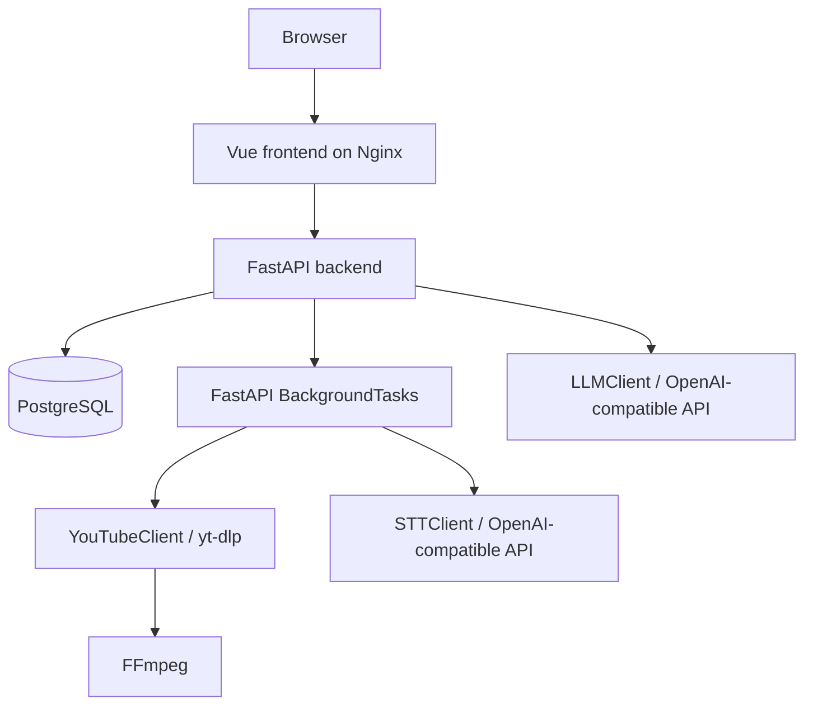

# Architecture

English Interview Coach for IT is a modular monolith with a FastAPI backend,
PostgreSQL persistence, and a Vue frontend served as static assets.

## Runtime View



## Backend Modules

- `app.api` contains routes, request/response schemas, error mapping, and DI.
- `app.services` contains business workflows for video processing and chat.
- `app.clients` wraps external integrations: YouTube, STT, LLM, and retry logic.
- `app.db` owns PostgreSQL connection handling, schema initialization, and
  repositories.
- `app.core` contains settings, logging, shared types, status enums, and YouTube
  URL normalization.

## Video Job Flow

1. `POST /api/v1/videos` validates and normalizes the YouTube URL.
2. `VideoProcessingService.create_job` creates or reuses a video record.
3. The route schedules `VideoProcessingService.process_job` as a background task.
4. The job transitions through `queued`, `processing`, `ready`, or `failed`.
5. The frontend polls `GET /api/v1/videos/{video_id}` and unlocks chat when the
   status is `ready`.

`BackgroundTasks` keeps the local MVP simple and Docker-friendly. It is not a
durable queue: jobs can be interrupted if the backend process stops.

## Data Model

- `videos`: YouTube URL, YouTube video id, title, nullable transcript, processing
  status, error message, and timestamps.
- `chat_sessions`: optional video link, title, and creation time.
- `messages`: session id, role, content, and creation time.

## Configuration

Settings use Pydantic v2 through `pydantic-settings`. Local configuration is read
from `.env`, while Docker Compose passes service defaults and mounts storage/temp
directories.

## Error Handling

Controlled application errors return a consistent payload:

```json
{
  "detail": "Video was not found",
  "error_code": "api_not_found",
  "module": "api"
}
```

Unexpected exceptions are logged server-side and returned as a safe internal
server error without stack traces.
